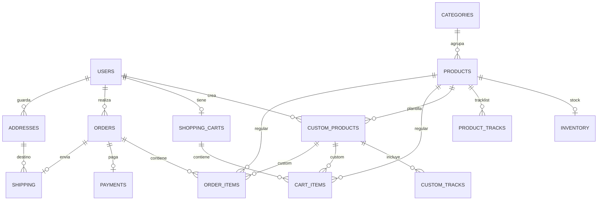

# Disc Market — Plan de arquitectura y primera versión

Documento de trabajo para completar **System Design**, **Visual Design and UI/UX** y el prototipo funcional del proyecto de E-Commerce (UPSLP, T56C).

La UI del producto es en **español**. Este plan está en español; los títulos entre comillas coinciden con los apartados del PDF.

---

## 1. Producto

### 1.1 Qué es

Tienda en línea **propia** (e-tailer B2C) de **CDs y vinilos**.

- Solo la tienda vende. El usuario **compra**, no publica ni vende.
- Catálogo de álbumes regulares (ediciones normales, especiales y coleccionables).
- Productos personalizados: el cliente configura un CD o vinilo (portada, tracks, mensaje, empaque).

### 1.2 Modelo de negocio

| Concepto | Decisión |
|---|---|
| Modelo | E-tailer (retail en línea) |
| Relación | B2C |
| Mercado inicial | México |
| Moneda | MXN |
| Roles | `customer`, `admin` |

### 1.3 Propuesta de valor

Personalización + formato físico. El cliente no solo compra un álbum existente: puede crear un producto con valor emocional, artístico o de regalo.

### 1.4 Catálogo inicial (del documento)

Mínimo **10** productos en el prototipo. Semilla documentada:

| Producto | Formato | Precio | Disponibilidad |
|---|---|---|---|
| Thriller – Michael Jackson | Vinyl | $699 | Available |
| 30 – Adele | CD | $199 | Available |
| Back in Black | Vinyl | $749 | Low Stock |
| Custom CD | CD | $99 | Available |
| Custom Vinyl | Vinyl | $799 | Made to Order |
| Abbey Road – The Beatles | Vinyl | $799 | Available |
| The Dark Side of the Moon – Pink Floyd | Vinyl | $829 | Available |
| Un Verano Sin Ti – Bad Bunny | CD | $249 | Available |
| Random Access Memories – Daft Punk | Vinyl | $899 | Low Stock |
| Sour – Olivia Rodrigo | CD | $229 | Available |

`Custom CD` y `Custom Vinyl` son **plantillas** (`CUSTOM_TEMPLATE`), no stock de anaquel.

---

## 2. Decisiones cerradas

1. Una sola tienda. Sin marketplace, Pro Shops ni vendedores terceros.
2. Stack: **NestJS + TypeORM** (backend), **React** (frontend), **PostgreSQL**.
3. El catálogo vive en base de datos (seed desde este plan / el PDF).
4. Idioma de la UI: **español**.
5. Pagos reales (pasarela) quedan fuera de la v1: checkout **simulado**.
6. Archivos (portadas y audios custom) en disco local en v1 (`/uploads`).

---

## 3. System Design

### 3.1 Arquitectura general

Monolito modular. Un API, una base, un cliente SPA.

```
┌─────────────────────┐
│  React SPA          │  UI en español
│  (Vite + TypeScript)│
└──────────┬──────────┘
           │ HTTPS / JSON / JWT
┌──────────▼──────────┐
│  NestJS             │  módulos de dominio
│  TypeORM            │
└──────────┬──────────┘
           │ SQL
┌──────────▼──────────┐     ┌─────────────────┐
│  PostgreSQL         │     │  /uploads       │
│  fuente de verdad   │     │  portadas/audio │
└─────────────────────┘     └─────────────────┘
```

Tres capas:

1. **Cliente** — presentación, formularios, carrito visual. Sin reglas de stock ni precios finales.
2. **API** — autenticación, validación, transacciones de carrito/pedido.
3. **Datos** — PostgreSQL. Archivos binarios fuera de la BD; solo se guarda la ruta.

No hay microservicios en v1.

### 3.2 Tecnologías

| Capa | Tecnología | Uso |
|---|---|---|
| Frontend | React + TypeScript + Vite | SPA |
| Enrutado | React Router | Páginas del prototipo |
| Datos cliente | TanStack Query | Catálogo, pedidos |
| Estilos | CSS modules o Tailwind + tokens | Identidad visual |
| Backend | NestJS | API REST `/api/v1` |
| ORM | TypeORM | Entities + migraciones |
| Auth | JWT + bcrypt | Login / registro / roles |
| Validación | class-validator + DTOs | Contratos HTTP |
| Base de datos | PostgreSQL | Relacional |
| Archivos | Multer + disco local | Portadas y tracks custom |
| Local | Docker Compose | `web`, `api`, `postgres` |

### 3.3 Módulos del sistema

| Módulo NestJS | Responsabilidad | Páginas / flujos |
|---|---|---|
| `auth` | Registro, login, refresh JWT, guards de rol | Login, Registro |
| `users` | Perfil del cliente y del admin | Cuenta |
| `catalog` | Categorías, productos, tracklist de álbumes | Home, Catálogo, Detalle |
| `inventory` | Stock disponible y reservado | Admin, checkout |
| `custom-products` | Configuración CD/vinilo + tracks subidos | Crea el tuyo |
| `cart` | Carrito activo por usuario | Carrito |
| `orders` | Checkout, items, confirmación | Checkout, confirmación |
| `payments` | Registro de pago (simulado en v1) | Checkout |
| `shipping` | Dirección, método, tracking | Checkout, admin |
| `uploads` | Guardar portadas y audios | Personalización |
| `admin` | CRUD de catálogo y avance de pedidos | Panel interno |

Comunicación entre módulos: **servicios inyectados**, no HTTP interno.

### 3.4 Contrato HTTP (v1)

Prefijo: `/api/v1`. JSON. Paginación `{ data, meta }`. Errores `{ statusCode, message, error }`.

**Públicos**

- `POST /auth/register` `POST /auth/login` `POST /auth/refresh`
- `GET /products` (filtros: formato, artista, categoría, precio)
- `GET /products/:id`
- `GET /categories`

**Cliente autenticado**

- `GET/POST/PATCH/DELETE /cart/items`
- `POST /custom-products` y `PATCH /custom-products/:id`
- `POST /custom-products/:id/tracks` (upload + orden)
- `POST /orders`
- `GET /orders` `GET /orders/:id`
- `GET/POST /addresses`

**Admin**

- CRUD de productos, categorías e inventario
- `PATCH /admin/orders/:id/status`
- `PATCH /admin/shipping/:id`

### 3.5 Customer journey (del PDF)

**Compra regular**

1. Descubrimiento → 2. Home → 3. Búsqueda/catálogo → 4. Detalle → 5. (si aplica) personalización → 6. Carrito → 7. Checkout → 8. Confirmación → 9. Envío.

**Producto personalizado**

1. Elegir formato (CD o vinilo) → 2. Subir audios → 3. Ordenar tracks → 4. Subir artwork → 5. Título y mensaje → 6. Empaque → 7. Resumen → 8. Agregar al carrito.

### 3.6 Dos tipos de producto

| Tipo | `product_type` | Stock | Cómo entra al carrito |
|---|---|---|---|
| Álbum de catálogo | `REGULAR` | `inventory` | `product_id` |
| Plantilla custom | `CUSTOM_TEMPLATE` | Made to order | Se crea `custom_product` y el item usa `custom_product_id` |

Un renglón de carrito/pedido apunta a **uno u otro**, nunca a ambos.

---

## 4. Diseño inicial de base de datos

PostgreSQL. IDs `SERIAL`. Dinero `NUMERIC(10,2)` MXN. TypeORM **sin** `synchronize`; schema por migraciones.

### 4.1 Diagrama



### 4.2 Tablas

Las tablas del PDF se conservan. Se agregan `product_tracks` (tracklist de álbumes) y `addresses` (checkout/envío).

#### `users`

| Columna | Tipo | Notas |
|---|---|---|
| `user_id` | `SERIAL PK` | |
| `name` | `VARCHAR(120) NOT NULL` | |
| `email` | `VARCHAR(180) UNIQUE NOT NULL` | |
| `password_hash` | `VARCHAR(255) NOT NULL` | bcrypt |
| `role` | `VARCHAR(20) NOT NULL` | `customer` \| `admin` |
| `phone` | `VARCHAR(20)` | opcional |
| `created_at` | `TIMESTAMPTZ NOT NULL` | `now()` |
| `updated_at` | `TIMESTAMPTZ NOT NULL` | |

#### `categories`

| Columna | Tipo | Notas |
|---|---|---|
| `category_id` | `SERIAL PK` | |
| `category_name` | `VARCHAR(80) UNIQUE NOT NULL` | Pop, Rock, Custom, … |
| `slug` | `VARCHAR(80) UNIQUE NOT NULL` | filtros y rutas |

#### `products`

| Columna | Tipo | Notas |
|---|---|---|
| `product_id` | `SERIAL PK` | |
| `category_id` | `INT NOT NULL FK → categories` | |
| `name` | `VARCHAR(180) NOT NULL` | |
| `artist` | `VARCHAR(180)` | null en plantillas custom |
| `format` | `VARCHAR(10) NOT NULL` | `CD` \| `VINYL` |
| `price` | `NUMERIC(10,2) NOT NULL` | |
| `description` | `TEXT` | |
| `image_url` | `VARCHAR(500)` | |
| `product_type` | `VARCHAR(20) NOT NULL` | `REGULAR` \| `CUSTOM_TEMPLATE` |
| `is_customizable` | `BOOLEAN NOT NULL DEFAULT false` | |
| `availability_status` | `VARCHAR(20) NOT NULL` | `AVAILABLE` \| `LOW_STOCK` \| `MADE_TO_ORDER` \| `OUT_OF_STOCK` |
| `created_at` | `TIMESTAMPTZ NOT NULL` | |

Índices: `format`, `category_id`, `artist`, `product_type`.

#### `product_tracks`

Tracklist del detalle de un álbum regular (el PDF lo pide; no tenía tabla).

| Columna | Tipo | Notas |
|---|---|---|
| `track_id` | `SERIAL PK` | |
| `product_id` | `INT NOT NULL FK → products` | `ON DELETE CASCADE` |
| `track_name` | `VARCHAR(180) NOT NULL` | |
| `track_order` | `INT NOT NULL` | |
| `duration_seconds` | `INT` | |
| unique | `(product_id, track_order)` | |

#### `inventory`

Solo productos `REGULAR`.

| Columna | Tipo | Notas |
|---|---|---|
| `inventory_id` | `SERIAL PK` | |
| `product_id` | `INT UNIQUE NOT NULL FK → products` | 1:1 |
| `quantity_available` | `INT NOT NULL DEFAULT 0` | `>= 0` |
| `quantity_reserved` | `INT NOT NULL DEFAULT 0` | |

Regla: `available = 0` → `OUT_OF_STOCK`. `available <= 3` → `LOW_STOCK`. Custom no usa esta tabla (`MADE_TO_ORDER`).

#### `custom_products`

| Columna | Tipo | Notas |
|---|---|---|
| `custom_product_id` | `SERIAL PK` | |
| `user_id` | `INT NOT NULL FK → users` | |
| `product_id` | `INT NOT NULL FK → products` | plantilla Custom CD/Vinyl |
| `format` | `VARCHAR(10) NOT NULL` | debe coincidir con la plantilla |
| `title` | `VARCHAR(180)` | |
| `cover_image` | `VARCHAR(500)` | |
| `message` | `TEXT` | |
| `packaging_option` | `VARCHAR(40)` | `standard` \| `gift` \| `collector` |
| `price` | `NUMERIC(10,2) NOT NULL` | copia de la plantilla |
| `status` | `VARCHAR(20) NOT NULL` | `draft` \| `configured` |
| `created_at` | `TIMESTAMPTZ NOT NULL` | |

#### `custom_tracks`

| Columna | Tipo | Notas |
|---|---|---|
| `track_id` | `SERIAL PK` | |
| `custom_product_id` | `INT NOT NULL FK → custom_products` | CASCADE |
| `track_name` | `VARCHAR(180) NOT NULL` | |
| `file_path` | `VARCHAR(500) NOT NULL` | |
| `track_order` | `INT NOT NULL` | |
| `duration` | `INT` | segundos |
| unique | `(custom_product_id, track_order)` | |

#### `shopping_carts`

| Columna | Tipo | Notas |
|---|---|---|
| `cart_id` | `SERIAL PK` | |
| `user_id` | `INT UNIQUE NOT NULL FK → users` | un carrito vigente |
| `status` | `VARCHAR(20) NOT NULL` | `active` \| `converted` \| `abandoned` |
| `created_at` | `TIMESTAMPTZ NOT NULL` | |

#### `cart_items`

| Columna | Tipo | Notas |
|---|---|---|
| `cart_item_id` | `SERIAL PK` | |
| `cart_id` | `INT NOT NULL FK → shopping_carts` | |
| `product_id` | `INT FK → products` | nullable |
| `custom_product_id` | `INT FK → custom_products` | nullable |
| `quantity` | `INT NOT NULL` | `>= 1`; custom suele ser 1 |
| `unit_price` | `NUMERIC(10,2) NOT NULL` | snapshot |
| **CHECK** | un solo FK: `product_id` **o** `custom_product_id` | |

#### `addresses`

No estaba en el PDF; el checkout y `shipping` la necesitan.

| Columna | Tipo | Notas |
|---|---|---|
| `address_id` | `SERIAL PK` | |
| `user_id` | `INT NOT NULL FK → users` | |
| `recipient_name` | `VARCHAR(120) NOT NULL` | |
| `street` | `VARCHAR(180) NOT NULL` | |
| `city` | `VARCHAR(80) NOT NULL` | |
| `state` | `VARCHAR(80) NOT NULL` | |
| `zip_code` | `VARCHAR(12) NOT NULL` | |
| `country` | `VARCHAR(60) NOT NULL` | default `México` |

#### `orders`

| Columna | Tipo | Notas |
|---|---|---|
| `order_id` | `SERIAL PK` | |
| `user_id` | `INT NOT NULL FK → users` | |
| `total_amount` | `NUMERIC(10,2) NOT NULL` | |
| `order_status` | `VARCHAR(20) NOT NULL` | `pending` \| `confirmed` \| `preparing` \| `shipped` \| `delivered` \| `cancelled` |
| `payment_status` | `VARCHAR(20) NOT NULL` | `pending` \| `paid` \| `failed` \| `refunded` |
| `created_at` | `TIMESTAMPTZ NOT NULL` | |

#### `order_items`

| Columna | Tipo | Notas |
|---|---|---|
| `order_item_id` | `SERIAL PK` | |
| `order_id` | `INT NOT NULL FK → orders` | |
| `product_id` | `INT FK → products` | nullable |
| `custom_product_id` | `INT FK → custom_products` | nullable |
| `quantity` | `INT NOT NULL` | |
| `unit_price` | `NUMERIC(10,2) NOT NULL` | snapshot |
| `item_name` | `VARCHAR(180) NOT NULL` | snapshot |
| **CHECK** | igual que `cart_items` | |

#### `payments`

| Columna | Tipo | Notas |
|---|---|---|
| `payment_id` | `SERIAL PK` | |
| `order_id` | `INT UNIQUE NOT NULL FK → orders` | 1:1 en v1 |
| `payment_method` | `VARCHAR(30) NOT NULL` | `card` \| `transfer` \| `simulated` |
| `payment_status` | `VARCHAR(20) NOT NULL` | `pending` \| `paid` \| `failed` |
| `amount` | `NUMERIC(10,2) NOT NULL` | |
| `created_at` | `TIMESTAMPTZ NOT NULL` | |

#### `shipping`

| Columna | Tipo | Notas |
|---|---|---|
| `shipping_id` | `SERIAL PK` | |
| `order_id` | `INT UNIQUE NOT NULL FK → orders` | |
| `address_id` | `INT NOT NULL FK → addresses` | |
| `shipping_method` | `VARCHAR(40)` | `standard` \| `express` |
| `tracking_number` | `VARCHAR(60)` | |
| `shipping_status` | `VARCHAR(20) NOT NULL` | `preparing` \| `shipped` \| `delivered` |

### 4.3 Reglas de integridad

1. Un usuario, un carrito con `status = active`.
2. Custom no descuenta `inventory`.
3. Regular no entra al carrito si `quantity_available < quantity`.
4. Checkout en **una transacción**: `order` + `order_items` + `payment` + `shipping`, descuento de inventario, carrito `converted`.
5. Precio y nombre se copian a carrito/pedido (`unit_price`, `item_name`).
6. En BD solo rutas de archivo; el binario vive en `/uploads`.

### 4.4 Ajustes respecto al PDF

| En el documento | En este plan |
|---|---|
| `products` sin categoría ni tipo | `category_id`, `product_type`, `availability_status` |
| Tracklist del detalle sin tabla | `product_tracks` |
| `shipping` sin dirección | `addresses` |
| Ambos FKs a la vez en items | `CHECK` de exclusividad |
| Casi sin timestamps | `created_at` / `updated_at` |
| Inventario para todos | Solo `REGULAR` |

---

## 5. Visual Design and UI/UX

Dirección para el prototipo. Las capturas finales se toman de la v1 ya navegable.

### 5.1 Estructura de navegación

Navbar superior fija:

`Inicio` · `CDs` · `Vinilos` · `Productos personalizados` · `Crea el tuyo` · carrito · `Iniciar sesión` / cuenta

Rutas:

| Ruta | Página |
|---|---|
| `/` | Home |
| `/catalogo` | Catálogo (query `formato`, `artista`, `categoria`) |
| `/cds` `/vinilos` | Atajos de formato |
| `/productos/:id` | Detalle |
| `/crear` | Flujo de personalización |
| `/carrito` | Carrito |
| `/checkout` | Datos y pago simulado |
| `/pedido/:id` | Confirmación |
| `/iniciar-sesion` `/registro` | Auth |
| `/admin` | Catálogo y pedidos (solo admin) |

### 5.2 Home

- Hero de la tienda (físico + personalización).
- Destacados, ediciones especiales y entrada a “Crea el tuyo”.
- Cortes por formato: CDs y vinilos.

### 5.3 Catálogo

Cada card muestra: imagen, nombre, artista, formato, precio, disponibilidad, botón “Ver más”.

Filtros: formato, artista, precio, categoría.

Estados de disponibilidad visibles: Disponible, Pocas piezas, Bajo pedido, Agotado.

### 5.4 Detalle de producto

Nombre, artista, portada, precio, formato, descripción, tracklist, stock, cantidad, agregar al carrito.

Si es plantilla custom, CTA hacia `/crear` con el formato precargado.

### 5.5 Crea el tuyo

Wizard: formato → audios → orden → portada → título/mensaje → empaque → resumen → carrito.

### 5.6 Carrito

Lista de items (regular o custom), cantidad, precio unitario y total. Vacío con CTA al catálogo. Paso siguiente: checkout.

### 5.7 Identidad visual (v1)

| Token | Propuesta |
|---|---|
| Personalidad | Tienda física de discos: cálida, coleccionable, no “tech SaaS” |
| Fondo | Off-black / carbón |
| Superficie | Gris oscuro para cards |
| Acento | Ámbar o vinilo rojo para precio y CTAs |
| Texto | Blanco / gris claro |
| Títulos | Sans geométrica |
| Cuerpo | Sans neutra |
| Cards | Portada casi cuadrada (vinilo/CD) |
| Breakpoints | 375 / 768 / 1280 |

Microinteracciones del prototipo: hover en cards, transición de navbar, wizard paso a paso, feedback al agregar al carrito.

---

## 6. Alcance de la primera versión (prototipo)

### 6.1 Incluye

- Navegación entre: home, catálogo, detalle, crea el tuyo, carrito, login, registro.
- Catálogo con ≥ 10 productos y filtros.
- Detalle con tracklist y stock.
- Personalización básica (formato, tracks, portada, mensaje, empaque).
- Carrito y checkout simulado.
- Confirmación de pedido.
- Postgres + TypeORM + seed.
- UI en español.
- Hover / transiciones simples.

### 6.2 No incluye (después)

- Stripe u otra pasarela real.
- Guías de envío compradas en plataforma.
- Reviews, chat, wishlist.
- App móvil nativa.
- i18n (la UI nace en español).

---

## 7. Orden de implementación

1. Docker Compose (`api`, `web`, `postgres`) y esqueletos NestJS / React.
2. Migraciones TypeORM de las tablas de la sección 4.
3. Seed de categorías, 10 productos e inventario.
4. Auth (registro, login, JWT, roles).
5. Catálogo público + detalle.
6. Carrito y checkout simulado.
7. Flujo “Crea el tuyo” + uploads.
8. Panel admin mínimo (productos y estado de pedidos).
9. Identidad visual y microinteracciones.
10. Redactar en el PDF **System Design** y **Visual Design and UI/UX** con diagramas y capturas reales.

---

## 8. Repositorios

| Repo | Contenido |
|---|---|
| `disc-market-backend` | NestJS, TypeORM, migraciones, seed, este plan |
| `disc-market-frontend` | React, rutas, UI en español |

PDF de la materia: `UNIVERSIDAD POLITÉCNICA DE SAN LUIS POTOSÍ.pdf` (raíz del backend).
